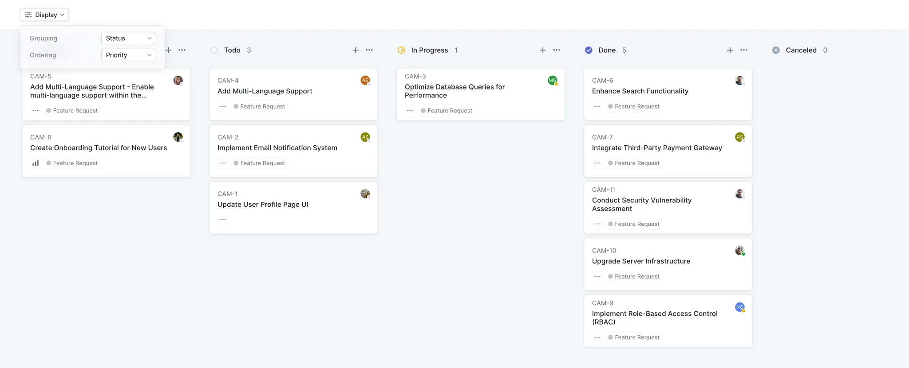
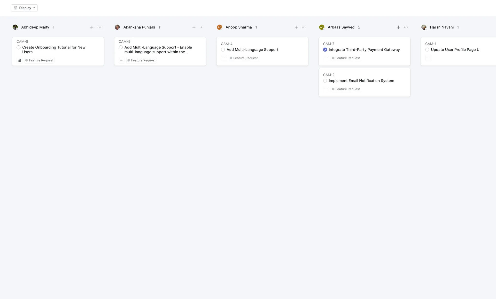
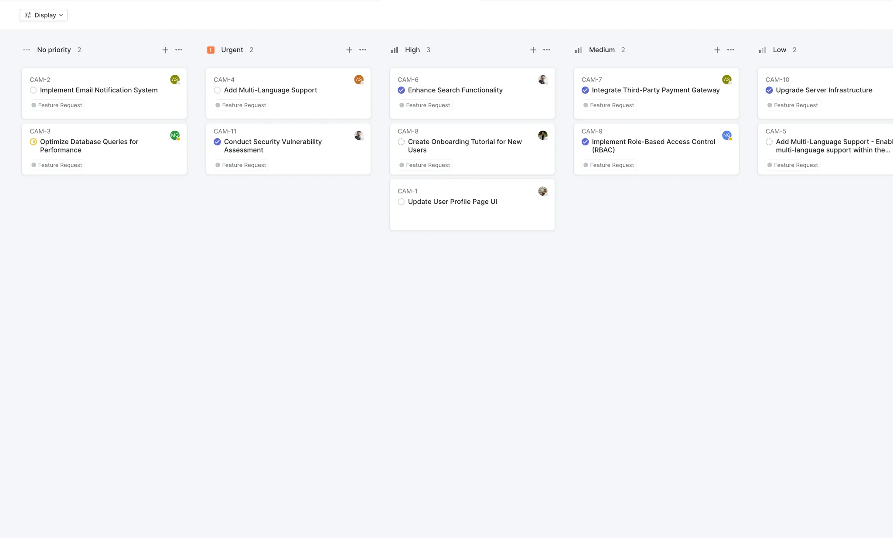
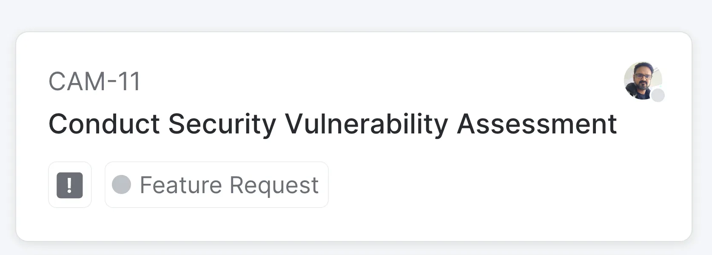

# Frontend Assignment

# **Use React JS for the Assignment**

**Design:**

**Display state:**

**State based on display. - Grouping by user is selected.**

**Grouping by priority is selected.**

**Card:**

**Api** : https://api.quicksell.co/v1/internal/frontend-assignment

You are required to create an interactive Kanban board application using React JS that interacts with the provided API from https://api.quicksell.co/v1/internal/frontend-assignment

When a user clicks the "display" button and selects a grouping option, the Kanban board should dynamically adjust to reflect the user's choice.

The application should offer three distinct ways to group the data:

1. **By Status**: Group tickets based on their current status.
2. **By User**: Arrange tickets according to the assigned user.
3. **By Priority**: Group tickets based on their priority level.

Users should also be able to sort the displayed tickets in two ways:

1. **Priority**: Arrange tickets in descending order of priority.
2. **Title**: Sort tickets in ascending order based on their title.

The Kanban board should be responsive and visually appealing, with a design similar to the provided screenshots.

**The priority levels for the tickets are as follows:**

- Urgent (Priority level 4)
- High (Priority level 3)
- Medium (Priority level 2)
- Low (Priority level 1)
- No priority (Priority level 0)

**Priority levels: (This values you will receive in the api)**

4 - Urgent

3 - High

2 - Medium

1 - Low

0 - No priority

Additionally, the application should save the user's view state even after page reload.

**Assets**

[Assets](./docs/assets.zip)

**Note:**

1. Don’t use css library like Bootstrap, Tailwind, Vite, Material UI, Charka…etc
2. Don’t use NextJs or similar framework. Code in pure ReactJS
3. Write Pure CSS Code only. No library for css (bootstrap,..etc). Styled JSX can be used though

## **Evaluation Criteria**

Your work will be evaluated based on the following criteria:

> UI Should Look exactly same as screenshot.

1. **Functionality**: The application should effectively fetch data from the provided API and allow users to group and sort tickets based on the given options.
2. **Visual Design**: The UI should match the provided design, including the layout, card design, and overall aesthetics.
3. **Business Logic Optimization**
4. **Component Structuring**: Components should be appropriately structured, promoting reusability and maintainability.

## **Task Submission**

1. Zip your source code and upload it to Google Form

https://forms.gle/SRb9d6jKEEXJhXG76

1. Host the website somewhere and provide the link for evaluation.

Good luck with your assignment!
